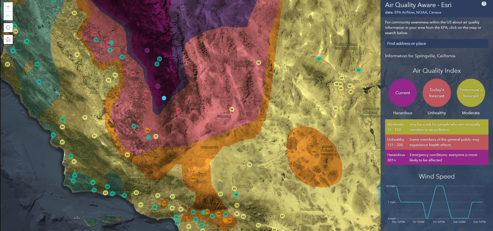

# Air Quality Aware App

The Air Quality Aware app is intended to provide information about the current conditions of air quality in the United States, along with the potential human health impacts. 

[View it live](https://livingatlas.arcgis.com/airquality/)

## Features
Click on a location in the U.S. to see the AQI (including ozone and particulate matter) for now, later today, and tomorrow.

The National Weather Service’s 72-hour forecast for wind will also be displayed. Scroll down the page and find information for the same Census Tract on racial composition and other at-risk populations for degraded air quality.

## Requirements

- [ArcGIS API for JavaScript (version 4.17)](https://developers.arcgis.com/javascript/index.html)
- [D3.js](https://d3js.org/)
- [React.js](https://reactjs.org/)

## Resources
- The Environmental Protection Agency [AirNow](https://www.airnow.gov/) program for current and future Air Quality Index information.
- The NOAA National Weather Service [wind forecast](https://www.arcgis.com/home/item.html?id=47ed83c3b4f943118e848fbfc33d119e).
- U.S. Census - derived [American Community Survey](https://livingatlas.arcgis.com/en/browse/#d=2&q=ACS&cont=true) demographic data, along with variables derived by Esri.

## Issues

Find a bug or want to request a new feature?  Please let us know by submitting an issue.

## Contributing

Esri welcomes contributions from anyone and everyone. Please see our [guidelines for contributing](https://github.com/esri/contributing).